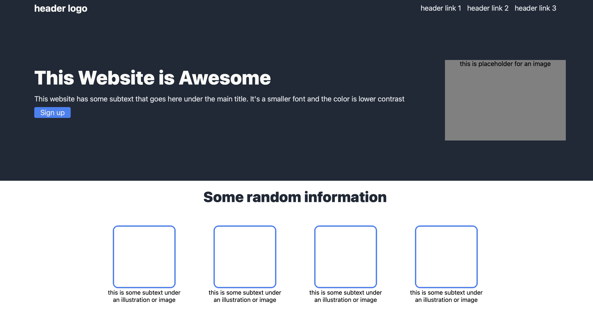
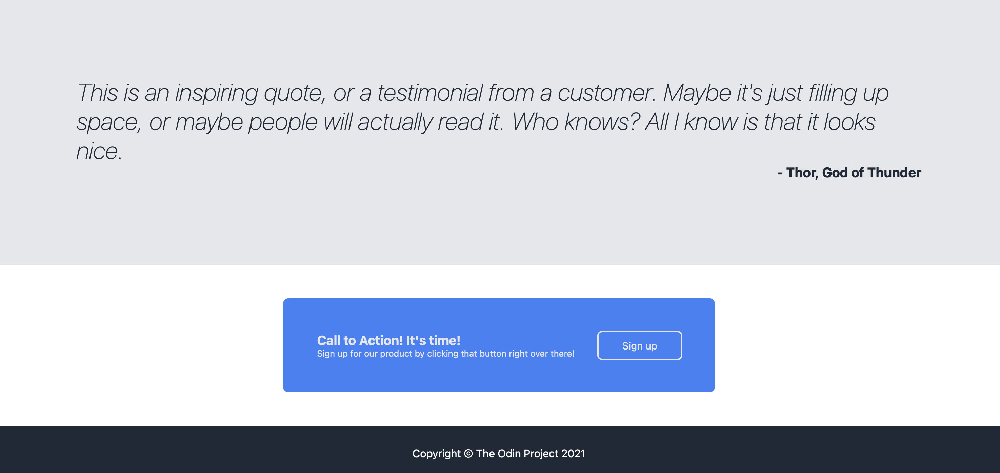

# The Landing Page

The landing page project was not easy, as it required me to use all what I learnt from HTML and CSS, and beyond. I applied what I learnt from The Odin Project and tried my best to recreate the webpage that was given to me. I feel there are some things that I could have done better in and could have used a more effiecient or cleaner code in CSS. But, I am glad of my progress thus far and cannot wait to apply what I learnt in future projects.

